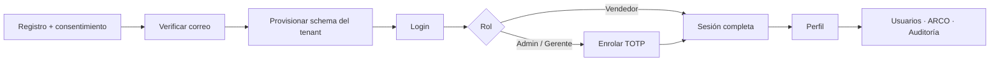
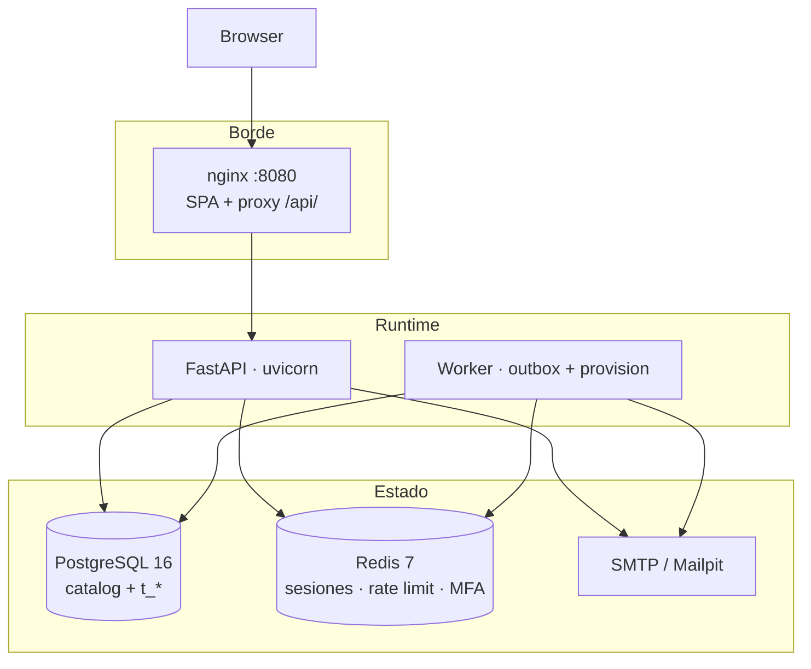

<p align="center">
  
</p>

<p align="center">
  
  
  
  
  
  
  
</p>

<p align="center">
  <strong>Plataforma de alta para empresas, con tenancy real, MFA y derechos ARCO desde el día uno.</strong><br>
  <sub>UI en español latinoamericano · contrato OpenAPI 3.1 · código, esquema y commits en inglés</sub>
</p>

---

## Por qué existe este repo

NEXUS no arranca como un CRUD genérico. El corte **Foundation** deja listo el suelo que el resto del CRM no puede improvisar después: **una empresa = un tenant**, **un correo = un tenant en toda la plataforma**, sesiones duras, roles de verdad y **Ley 1581** (habeas data + canal ARCO).

Este repositorio contiene **solo el slice A**. Contactos, pipeline, WhatsApp, copilot NEXUS AI y el dashboard comercial están fuera de este árbol a propósito.

| Listo ahora | Siguiente |
|---|---|
| Alta self-serve + primer Administrador | M1 Contactos / cuentas |
| Consentimiento, verificación de correo, recovery | M2 Pipeline Kanban |
| MFA TOTP obligatorio Admin/Gerente | M4 Inbox WhatsApp-first |
| Invitaciones, cupo de asientos, RBAC | M3 Copilot (LangGraph) |
| ARCO público + bandeja Admin + auditoría inmutable | M7 Dashboard |

---

## Recorrido de producto



**Plan Starter:** 2 asientos. El schema PostgreSQL del tenant (`t_{32-hex}`) se crea **después** de verificar el correo, no en el signup. El signup público siempre responde `202` con cuerpo vacío: no se enumera si el correo ya existe.

---

## Arquitectura

Monolito modular. Un proceso de API, un worker, un SPA. Sin subdominios: el tenant vive en la ruta `/t/:slug/…` y en el schema de base de datos.



| Pieza | Rol |
|---|---|
| `catalog` | Tenants, usuarios, identidades, tokens hasheados, outbox, consentimiento, auditoría de plataforma |
| `t_*` | Datos de la empresa, aislados por `search_path` |
| Redis | Sesión opaca `nexus_session` (12 h absolutas, 30 min idle), retos MFA, límites |
| nginx | Única puerta al host. La API **no** publica `:8000` |

**Decisiones ya cerradas**

| ADR | Decisión |
|---|---|
| 0001 | Monolito modular FastAPI + React |
| 0002 | Schema-per-tenant + catálogo de plataforma |
| 0003 | Sesiones cookie `httpOnly` + `SameSite=Lax` |
| 0004 | REST `/api/v1` · OpenAPI 3.1 como contrato |
| 0005 | Provisionar schema tras verificar el correo |

---

## Superficie de seguridad

Nada de esto es “fase 2”. Va en Foundation porque un CRM de LATAM que toca PII no puede nacer abierto.

- **Contraseñas** Argon2id (fuera del event loop). **TOTP** `valid_window=0`. Códigos de respaldo de un solo uso, con lock de fila.
- **MFA** obligatorio para `administrador` y `gerente`. `vendedor` no enrola.
- **Cookies** `Secure` por defecto (`SESSION_COOKIE_SECURE=false` solo en HTTP local).
- **CSRF** de first-party: header `X-Nexus-Client: web` en mutaciones. El SPA lo envía solo.
- **Rate limit** atómico en Redis: login, signup, resend, reset, ARCO público, MFA por cuenta.
- **Tokens** de verify / invite / reset: hash en disco; el valor crudo sale por SMTP. Si SMTP falla, el outbox reintenta con el token cifrado bajo `NEXUS_DATA_KEY` (32 bytes, sin default).
- **ARCO** público en `/t/:slug/arco`, bandeja Admin, solicitud propia, ingreso manual. Auditoría append-only (REVOKE + `DO INSTEAD NOTHING`).
- **Un correo, un tenant** en toda la plataforma. Invitar un correo ya ocupado: `409 email_taken`.

> Compose local publica Postgres y Mailpit. Redis queda en la red interna. No uses la `NEXUS_DATA_KEY` de `.env.example` fuera de tu máquina.

---

## Stack

| Capa | Tecnología |
|---|---|
| API / worker | Python 3.12 · FastAPI · SQLAlchemy 2 async · Alembic · Argon2 · PyOTP |
| SPA | React 18 · TypeScript · Vite · Tailwind · TanStack Query · Zustand |
| Datos | PostgreSQL 16 · Redis 7 |
| Contrato | [`api/openapi.yaml`](api/openapi.yaml) · [notas](docs/API.md) |
| UI | Plus Jakarta Sans · primario `#2563EB` · acento `#059669` · fondo `#F8FAFC` |

Errores: RFC 9457 `application/problem+json`. JSON en camelCase. FastAPI `/docs` **no** es el contrato; el YAML sí.

---

## Arranque local

Requisitos: Docker y un `.env` propio.

```bash
cp .env.example .env
# Genera 32 bytes reales para NEXUS_DATA_KEY. No dejes el placeholder.
cd docker
docker compose up --build
```

| Qué | Dónde |
|---|---|
| App (SPA + API proxied) | http://localhost:8080 |
| Health | http://localhost:8080/api/v1/healthz |
| Mailpit | http://localhost:8025 |

Entra por **8080**. No hay API en el host `:8000`.

Sin Docker, el backend de tests usa PostgreSQL embebido (`pgserver`) + `fakeredis`:

```bash
# backend
python -m pytest tests -q

# frontend
cd frontend && npm test && npm run build
```

---

## Mapa del repo

```text
Nexus-CRM/
├── api/openapi.yaml      contrato HTTP (fuente de verdad)
├── backend/              FastAPI (app.main:app) + worker (python -m app.worker)
├── frontend/             SPA Vite
├── docker/               compose, Dockerfiles, nginx
└── docs/                 API notes + identidad visual
```

### Rutas de la SPA

| Ruta | Pantalla |
|---|---|
| `/registro` | Alta de empresa |
| `/verificar-email` | Verificar correo |
| `/ingresar` | Login |
| `/ingresar/mfa` | Reto TOTP / backup |
| `/ingresar/mfa/enrolar` | Enrolamiento TOTP |
| `/restablecer-contrasena` | Recovery |
| `/invitar/aceptar` | Aceptar invitación |
| `/t/:slug/arco` | ARCO público |
| `/app/perfil` | Perfil (todos los roles) |
| `/app/configuracion` | Empresa (Admin) |
| `/app/usuarios` | Usuarios e invitaciones (Admin) |
| `/app/arco` | Bandeja ARCO (Admin) |
| `/app/auditoria` | Auditoría (Admin) |

Roles: `administrador` · `gerente` · `vendedor`. Gerente y vendedor no ven superficies de Admin.

---

## Estado

Foundation **A** está implementado, cubierto por pytest (AC-1 a AC-8) y Vitest, y publicado en esta rama.

Lo que **no** está aquí —y no debe leerse en este README como si lo estuviera—: contactos, negocio, WhatsApp, IA, facturación, SSO.

<p align="center">
  
  <br>
  <sub>Lanxa Technology · NEXUS CRM · Foundation 0.1.0</sub>
</p>
